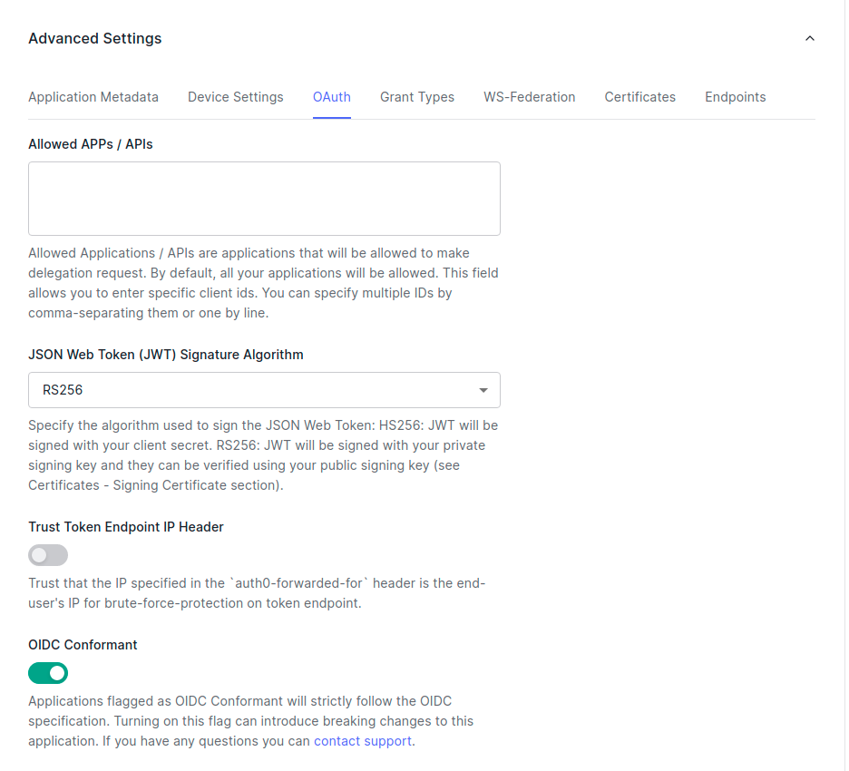

# Authentication with nextjs via @auth0/nextjs-auth0

[[toc]]

## Requirements

- Node.js: ^10.13.0 || >=12.0.0
- Next.js: >=10

## Installing the auth module

```bash
yarn add @auth0/nextjs-auth0
```

## Getting started

Create a **Regular Web Application** in the [**Auth0 Dashboard**](https://manage.auth0.com/dashboard/).


There are few things you will need to perform before going ahead. 


- Goto **settings**


- Scroll down to **Show advanced Settings**


- Under **Advanced Settings**, click on the **OAuth** tab.
- Ensure that **JsonWebToken Signature Algorithm** is set to **RS256** and that **OIDC Conformant** is **enabled**.



- Next, configure the following URLs for your application under the **Application URIs** section of the **Settings** page:

```
Allowed Callback URLs: http://localhost:3000/api/auth/callback
Allowed Logout URLs: http://localhost:3000/
```


## Creating the necessary files

### .env file

Create a `.env.local` in your root directory with the following content

```
# A long, secret value used to encrypt the session cookie
AUTH0_SECRET='LONG_RANDOM_VALUE'
# The base url of your application
AUTH0_BASE_URL='http://localhost:3000'
# The url of your Auth0 tenant domain
AUTH0_ISSUER_BASE_URL='https://YOUR_AUTH0_DOMAIN.auth0.com'
# Your Auth0 application's Client ID
AUTH0_CLIENT_ID='YOUR_AUTH0_CLIENT_ID'
# Your Auth0 application's Client Secret
AUTH0_CLIENT_SECRET='YOUR_AUTH0_CLIENT_SECRET'
```

For `AUTH_SECRET` you can run the following command to obtain the string.

```bash
node -e "console.log(crypto.randomBytes(32).toString('hex'))"
```

The other required parameters can be found in `settings` tab of your page. e.g. 

 

:::tip Note:
If you copy Auth0 tenant domain by clicking the copy button, it won't copy the full URI. you'll manually need to include `https://` to your copied string. 
:::

### [...auth] file:

under `/pages/api` create a new directory `auth` and then create `[...auth].js` inside it. 

```js
// pages/api/auth/[...auth].js

import { handleAuth } from '@auth0/nextjs-auth0';

export default handleAuth();

```

This will create the following routes:

 - `/api/auth/login`: Your Next.js application redirects users to your Identity Provider for them to log in.

 - `/api/auth/callback`: Your Identity Provider redirects users to this route after they successfully log in.

 - `/api/auth/logout`: Your Next.js application logs out the user.

 - `/api/auth/me`: You can fetch user profile information in JSON format.

### Modification to `_app.js`

```js
// pages/_app.js
import React from 'react';
import { UserProvider } from '@auth0/nextjs-auth0';

export default function App({ Component, pageProps }) {
  return (
    <UserProvider>
      <Component {...pageProps} />
    </UserProvider>
  );
}
```
:::tip Done!
Now you are ready to use authentication
:::

## Client side authentication

For client side auth, you need to use `useUser` hook. 

```js
// pages/index.js
import { useUser } from '@auth0/nextjs-auth0';

export default function Index() {
  const { user, error, isLoading } = useUser();

  if (isLoading) return <div>Loading...</div>;
  if (error) return <div>{error.message}</div>;

  if (user) {
    return (
      <div>
        Welcome {user.name}! <a href="/api/auth/logout">Logout</a>
      </div>
    );
  }

  return <a href="/api/auth/login">Login</a>;
}

```

or you can use `withPageAuthRequired` 

```js
// pages/profile.js
import { withPageAuthRequired } from '@auth0/nextjs-auth0';

export default withPageAuthRequired(function Profile({ user }) {
  return <div>Hello {user.name}</div>;
});

```

## API route protection

You can protect an api route by using `withApiAuthRequired`

```js
// pages/api/protected.js
import { withApiAuthRequired, getSession } from '@auth0/nextjs-auth0';

export default withApiAuthRequired(async function myApiRoute(req, res) {
  const { user } = getSession(req, res);
  res.json({ protected: 'My Secret', id: user.sub });
});

```

You can access the api via the following example:

```js
import useSWR from 'swr';
import { withPageAuthRequired } from '@auth0/nextjs-auth0';

const fetcher = async (uri) => {
  const response = await fetch(uri);
  return response.json();
};

export default withPageAuthRequired(function Products() {
  const { data, error } = useSWR('/api/protected', fetcher);
  if (error) return <div>oops... {error.message}</div>;
  if (data === undefined) return <div>Loading...</div>;
  return <div>{data.protected}</div>;
});

```

## Server side protection

You can protect a server side rendering page with `withPageAuthRequired`

```js
// pages/profile.js
import { withPageAuthRequired } from '@auth0/nextjs-auth0';

export default function Profile({ user }) {
  return <div>Hello {user.name}</div>;
}

// You can optionally pass your own `getServerSideProps` function into
// `withPageAuthRequired` and the props will be merged with the `user` prop
export const getServerSideProps = withPageAuthRequired();

```


